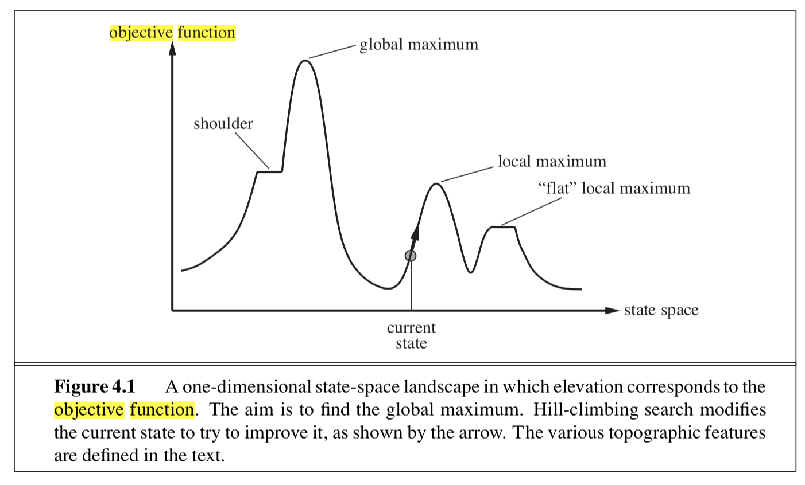
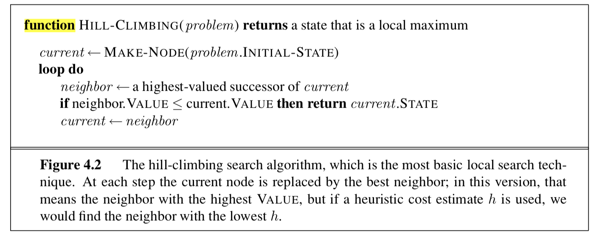
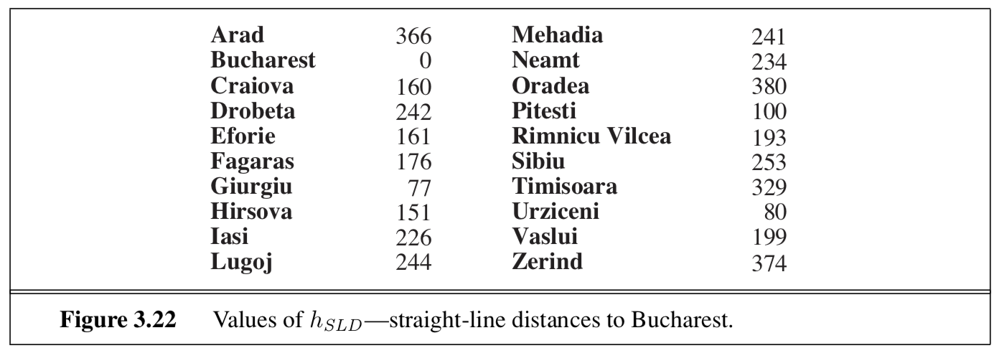
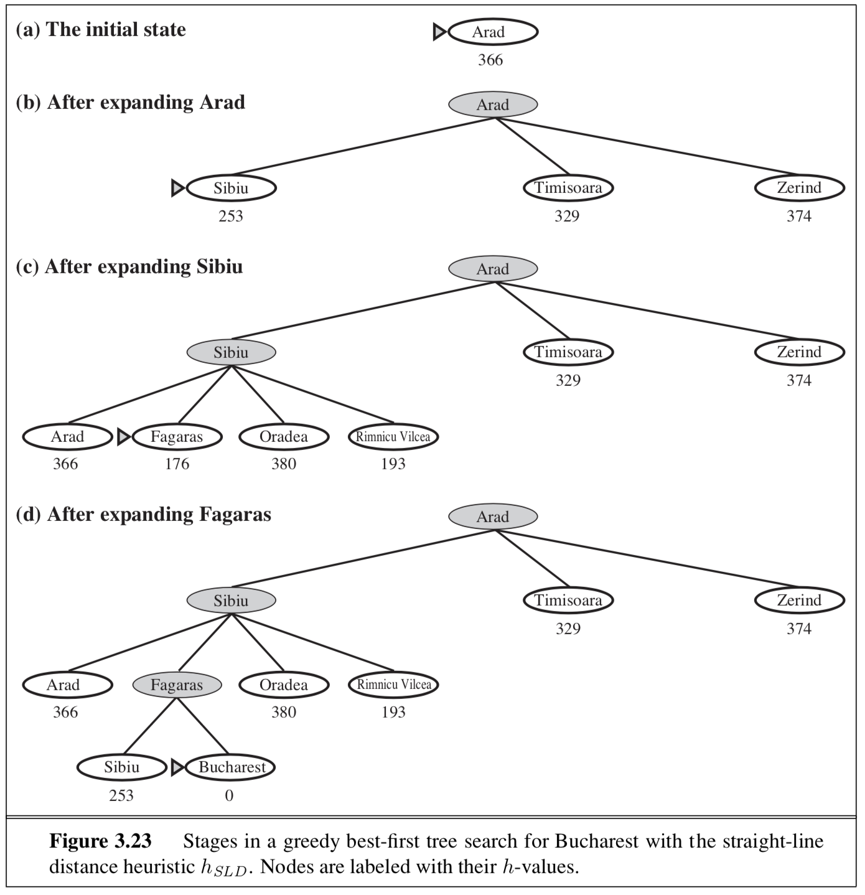
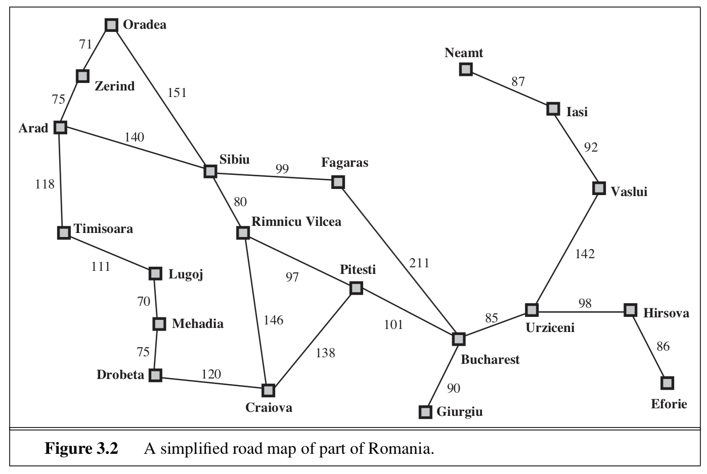
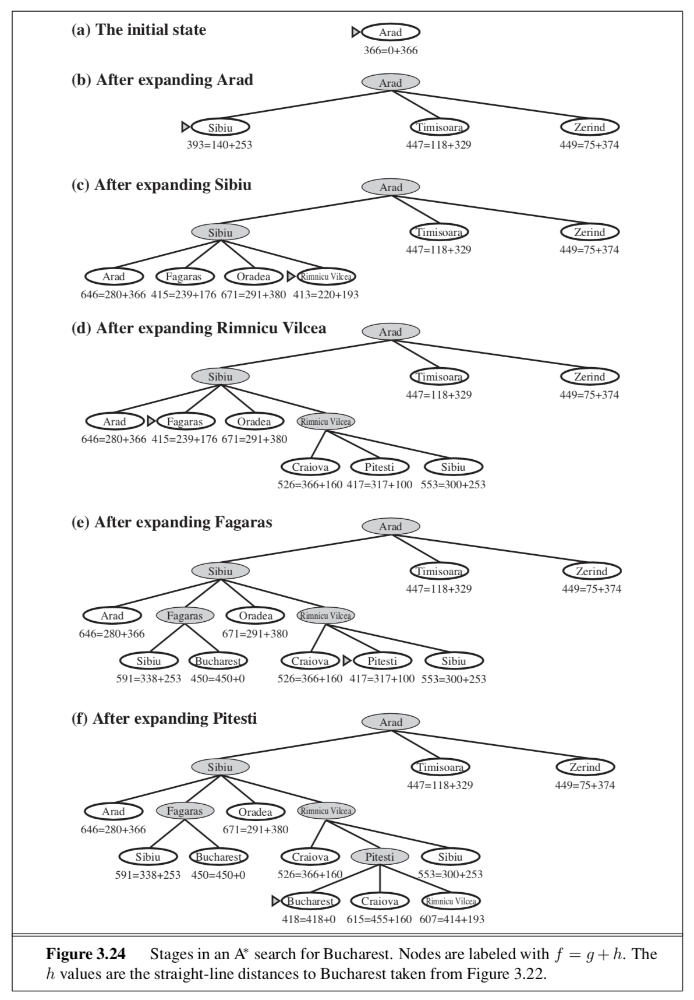
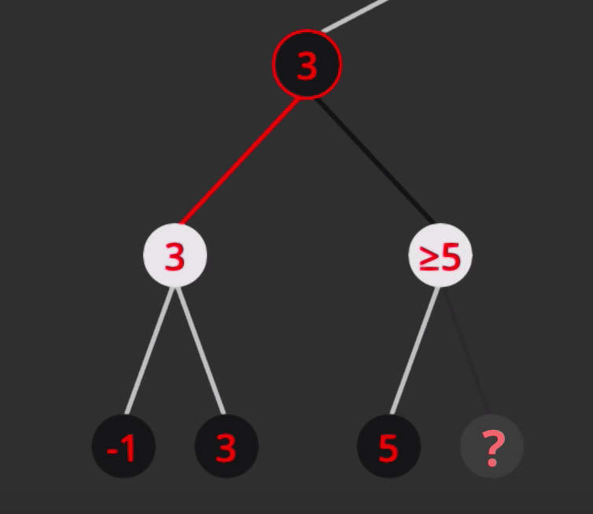
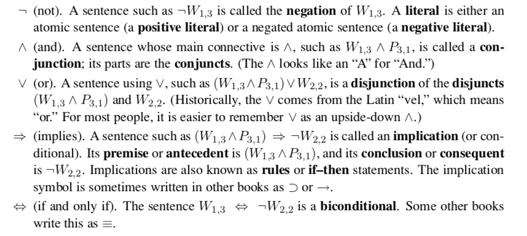
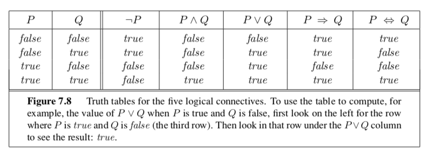
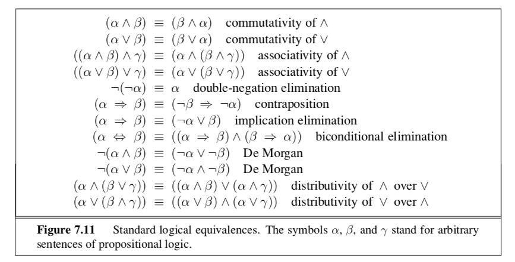

# AI Exam One

## Key Agent Terms  

**Performance Measure**  
If an agent performs a sequence that is desirable, then the agent has performed well. This notation of desirability is captured by a *performance measure* that evaluates any given sequence of environment states.  

**Actuators**  
The actuators for an automated taxi are:  

* control over engine through the accelerator
* conttol over the steering and breaking  

**Sensors**  
The basic sensors for the taxi are

* video cameras  
* infrared or sonar sensors to detect distance from other cars  

## Key Environment Terms  

### Deterministic vs Stochastic

**Deterministic**  
environments where any action taken influences its outcome, In chess if you move a pawn from A3 to A5 it will always work (there is no uncertainty).  
**Stochastic**  
environments have a level of uncertaint (any game that involves dice, or a taxi driving), you can never be certain of the number that will be rolled.

### Fully Observable vs Partially Observable

**Fully Observable**  
Agent's sensors give it access to the complete state of the environment at each point in time  
**Partially Observable**  
An environment might be partially observable because fo noisy and inaccurate sensors or because parts of the state are simply missing from the data sensors  

### Episodic vs Sequential

**Episodic**  
an agent's experience is divided into atomic episodes, in each episode the agent receives a percept and then performs a single action. *the next episode does not depend on the actions taken in previous episodes*. (determining if an item on an assembly line is defective)  
**Sequential**  
All current decisions could affect all future decisions (chess and taxi driving)

### Static vs Dynamic

**Static**  
If an environment doesn't change  
**Dynamic**  
If an environment can change while an agent is deliberating  
**Semidynamic**  
If the environment itself doesn't change with passage of time but the agent's performance score does, then we say the environment is *semidynamic*

### Discrete vs Continuous

**Discrete**  
Chess has a finite number of distinct states in its environment that can drive the final outcome of a task.  
**Continuous**  
Taxi-driving is a continuous-state and continuous-time problem. It relys on an unknown and rapidly changing data source.  

### Known and Unknown

**Known**  
In a known environment, the outcomes for all actions are given  
*it is possible for a known environment to be partially observable (solitare card game, you know the rules but unable to see the cards that have not been turned over)*  
**Unknown**  
The agent will have to learn how the eviornment works in order to make a good decision.  
*you can be fully observable - in a video game, the screen may show the entire game state but I still don't know what the buttons do until I try them*

## Graphs

### Local Search

**objective function** defines the best state.

* If elevation corresponds to cost, the aim is to find the lowest valley **global minimum**
* if the elevation corresponds to an **objective function** then the aim is to find the highest peak or a **global maximum**



### Hill Climbing Search  

This is a loop that continually moves in the direction of increasing value. It terminates when it reaches the peak. The algorithm does not maintain a search tree, so the data structure for the current node only records the value of the objective function.



### BDF (Breath Depth Search)  

The *shallowest* unexpanded node is chosen for expansion. An appropriate data structrue for the *frontier* would be a *queue*.

### Uniform-Cost Search  

Uniform-Cost Search expands the node with the *lowest path cost*. This is done by storing the frontier as a priority queue.  
*differences between Uniform-Cost Search and BDF*

* the goal test is applied to a node when it is *selected for expansion*, rather than when it is first generated because the first goal node that is generated might be on a suboptimal path.
* Another test is added in case a better path is found to a node currently on the frontier

### Informed (Heuristic) Search Strategies  

This uses problem-specific knowledge beyond the definition of the problem itself. This will find solutions more efficiently than an uninformed strategy.

#### Heuristic Function

*h(n)* estimated cost of the cheapest path from the state at node n to a goal state.

#### Greedy Best-First Search

Greedy uses the **straight line distance** heuristic. You need to know the straight line distance from each node to the goal node.  

Greedy will find a solution without ever expanding a node that is not on the solution path; hence, its search cost is minimal. However the Greedy search will not find the most optimal solution (it just tries to get as close to the goal as it can).





#### A* Search

A\* evaluates each node by combining the cost to reach the node you are trying to expand to and the heuristic.






### Adversarial Search

**Pruning** allows us to ignore portions of the search tree that make no difference to the final chocie when looking for an optimal move.  

**evaluation functions** allow us to approximate the true utility of a state without doing a complete search.

**imerfect information** not all cards are visible to each player (there is an element of chance) 

**game tree** a tree where the nodes are game states and the edges are moves. (for tic tac toe the game tree is relatively small, it has fewer than 9! terminal nodes)

#### Game can be defined as

* S0: the **inital state** which specifies how the game is set up at the start
* Player(s): Defines which player has to move in a state
* Action(s): returns the set of legal moves in a state
* Result(s,a): the **transition model**, which defines the result of a move
* Terminal-test(s): a **terminal test**, which is true when the game is over and false otherwise. States where the game has ended and called **terminal state**
* Utility(s,p): a **utility function** defines the final numeric value for a game that ends in terminal state *s* and for player *p*

#### Optimal decisions in games

**minimax decision** is the optimal choice for either Max or Min depending whos turn it is

**minimax algorithm** computes the minimax decision from the current state. it uses a simple recursive computation of the minimax values of each successor state, directly implementing the defining equations.  

* the minimax algorithm performs a complete depth first exploration of the game tree.

#### Alpha-Beta Pruning

**alpha** is the best already explored option along the path to the root for MAX  

**beta** the best already explored option along the path to the root for the MIN  

The search updates the values of alpha and beta as it goes along and prunes the remaning branches. As soon as the value of the current node is known to be worse than the current alpha or beta value it terminates the recursive call.

##### Procedure  

* You start at the root node, And the value at that node is initalized to its worst case, so the MAX would have a value of -infinity
* The node then explores its children
* Since no options have been explored yet, alpha and beta are set to their worst cases, -inf and +inf respectively
* Once you hit a leafnode you update whatever its parent's value is
* Once it's value is updated, before it begins to explore it check this condition  

``` python
if value(currNode) > beta:
    break
```

if the current vlaue is greater then beta then it doesn't need to search the other children and that side can be pruned  

* if the MIN is choosing its most optimal choice it would never select the greater value so we can prune that side. In this example 3 will always be picked over 5



### Knowledge-Based agents

**knowledge base** is a set of sentences or **axiom**, each sentence is expressed in a lanuguage called **Knowledge

* agent *Tells* the KB what it preceives
* agent *Asks* the KB what action to perform
* agent *Tells* KB which action was chosen
* agent executes that action

representation language** and represents an assertion about the world.  

**knowledge level** is where we specify only what the agent knows and what its goals are  

**declarative approach**  the agent designer can tell sentences one by one until the agent knows how to operate in its enviornment  

**procedural approach** encodes desired behaviors directly as program code.

**entailment** a sentence follows another sentence logically. The formal deffinition `is a |= b` if and only if, in everymodel in which *a* is true, *b* is also true

### The Wumpus World  

**performance measure**: +1000 for climbing out of the cave with the gold, -1000 for falling into a pit or being eaten by the wumpus. -1 for each action taken and -10 for using up the arrows.  

**enviornment**: 4x4 grid of rooms.

**actuators**: the agent can move forward, turn left, and turn right. The agent will die if he enters a square with a pit or runs into the wumpus. The agent will not move if he runs into a wall. The agent can grab if it is in the same square as the gold and can shoot the arrow in a straight line that it is facing.  

**sensors**: the agent has five sensors,

* The agent can smell the wumpus in adjacent squares
* The agent can feel a breeze if it is adjacent to a pit
* The agent can perceive glitter if it is in the same square as gold. 
* When the agent bumps into a wall it precieves a bump
* when the wumpus is killed it emits a scream

**proposition symbol** each symbol stands for a proposition that can be true or false.

#### logical connectives



